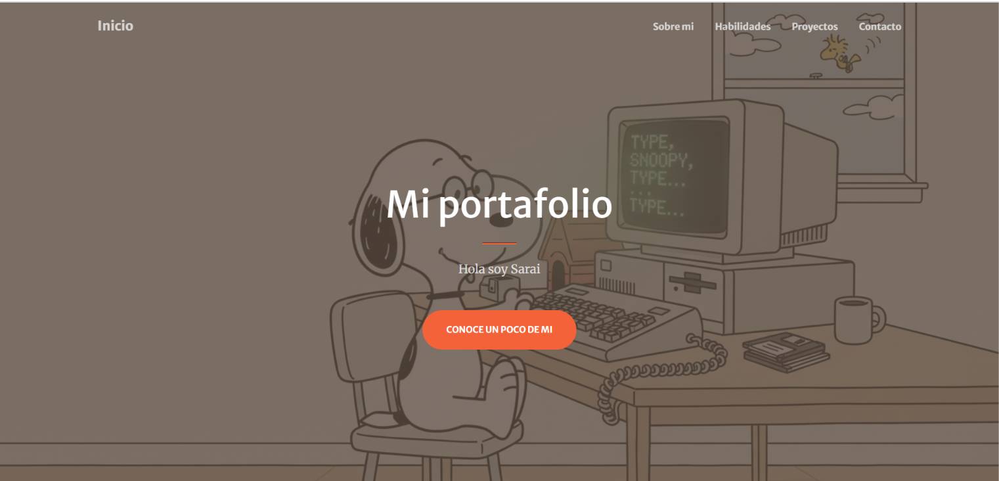
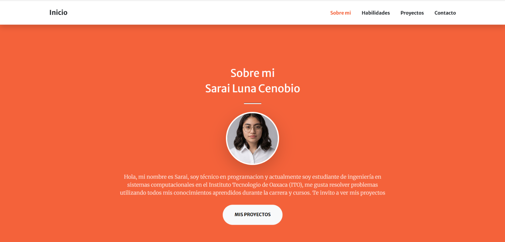
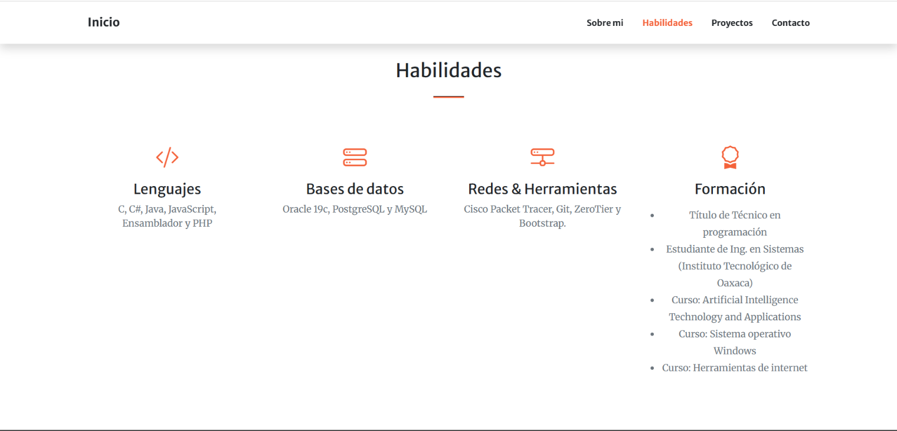
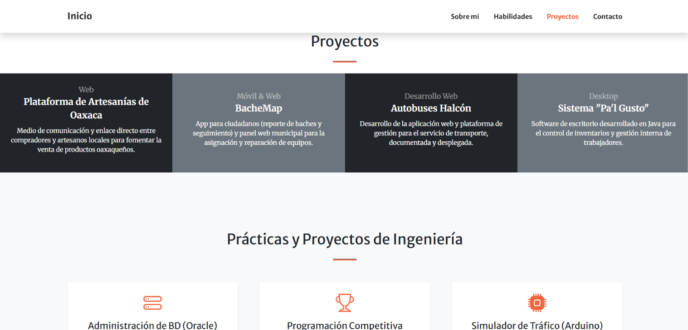
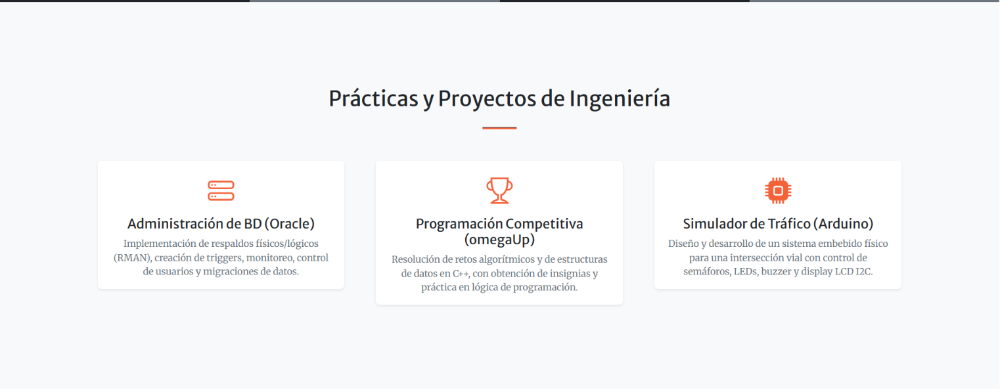
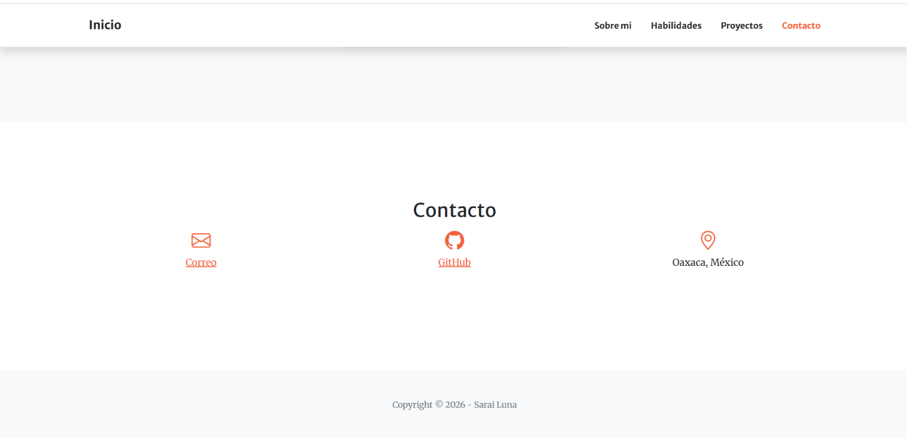

# Portafolio Web

**Materia:** Programación Web 

**Autor:**
Luna Cenobio Sarai

**Descripcion del proyecto:**  
Este proyecto consiste en el diseño y despliegue de un portafolio web personal y profesional.

* **Framework CSS utilizado:** [Bootstrap](https://getbootstrap.com/) (versión 5).
* **Plantilla Base:** [Start Bootstrap - Creative](https://startbootstrap.com/theme/creative)

---

## Estructura del Repositorio
El proyecto está organizado de la siguiente manera:

```text
Actividad 4/
│
├── .vscode/
├── css/
│   └── styles.css
├── img/
│   ├── snoopy1.jfif
│   ├── yo2.jpeg
│   └── yo6.jfif
├── js/
│   ├── portafolio.js
│   └── scripts.js
├── index.html
└── README.md

```
---


## Estructura y Secciones del Portafolio

El portafolio está estructurado mediante una navegación fluida de una sola página, compuesta por los siguientes menús y secciones:

1. Barra de Navegación (*Navbar*)
2. Inicio / Cabecera (*Masthead*)
3. Sobre mí (*About*)
4. Proyectos (*Portfolio*)
5. Contacto (*Contact*)

---

## Proceso de Creación (Paso a Paso)

El desarrollo y adaptación del portafolio se llevó a cabo mediante los siguientes pasos:

1. **Descarga y Configuración Inicial:**
   * Se descargó el código fuente de la plantilla *Start Bootstrap Creative* desde su sitio web oficial.
   * Se extrajo el proyecto en el entorno de desarrollo local y se abrió utilizando un editor de código (*Visual Studio Code*).
2. **Estructuración de Archivos:**
   * Se organizaron las carpetas de recursos (`assets/`, `css/`, `js/`) para asegurar que las rutas relativas funcionaran correctamente al cargar imágenes y hojas de estilo.
3. **Personalización del Contenido (`index.html`):**
   * Se editaron los textos predeterminados de la plantilla para reemplazarlos con información real.
   * Se configuraron las rutas de las imágenes de fondo principales.
4. **Adaptación de Secciones Clave:**
   * Se ajustó la sección de contacto para eliminar formularios complejos que requirieran backend y se habilitaron accesos directos claros (correo, GitHub y ubicación).
5. **Pruebas Locales:**
   * Se ejecutó el sitio web de manera local en el navegador para verificar la adaptabilidad en dispositivos móviles y escritorios.

---

## Modificaciones Realizadas y Justificación

* **Incorporación de Imagen de Fondo Personalizada:**
  * *Modificación:* Se cambió la imagen de fondo por defecto del *Masthead* apuntando a un recurso propio (`img/snoopy2.jfif`) utilizando propiedades CSS de degradado con transparencia (`linear-gradient`).
  * *Justificación:* Mantener un filtro oscuro semitransparente sobre la imagen de fondo garantiza que los títulos y textos blancos conserven un contraste óptimo y sean perfectamente legibles para cualquier visitante.
* **Optimización de la Sección de Contacto:**
  * *Modificación:* Se sustituyó el formato de envío de correos automatizado por tarjetas informativas con enlaces directos a medios de contacto reales.
  * *Justificación:* Ofrece una vía de comunicación directa, rápida y sin fricciones técnicas para posibles reclutadores o colaboradores.

---

## Capturas de pantalla

**Inicio**


**Sobre mi**


**Habilidades**


**Proyectos**




**Contacto**



